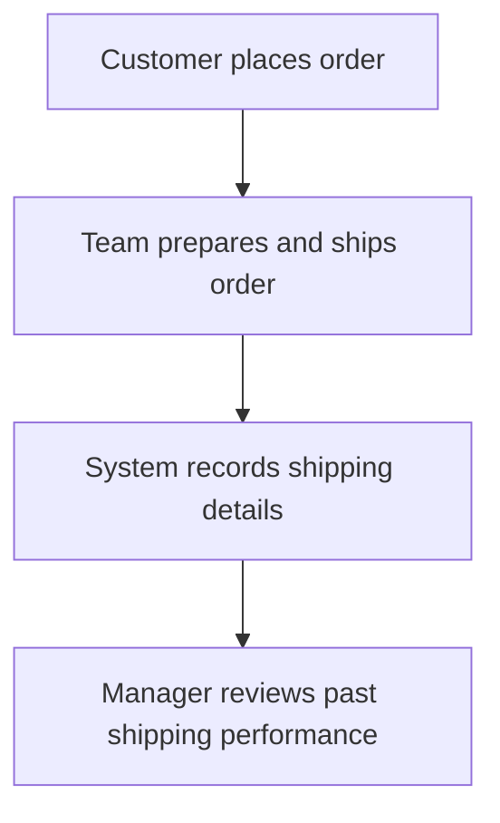

# As-Is Fulfilment Process

This diagram shows the assumed workflow before ShipSense 360.

```mermaid
flowchart TD
    A[Customer places order] --> B[Team prepares and ships order]
    B --> C[System records shipping details]
    C --> D[Manager reviews past shipping performance]
```