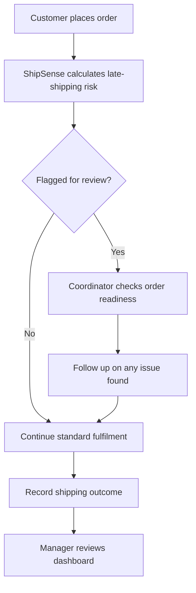

# To-Be Fulfilment Process

```mermaid
flowchart TD
    A[Customer places order] --> B[ShipSense calculates late-shipping risk]
    B --> C{Flagged for review?}
    C -->|Yes| D[Coordinator checks order readiness]
    C -->|No| E[Continue standard fulfilment]
    D --> F[Follow up on any issue found]
    F --> E
    E --> G[Record shipping outcome]
    G --> H[Manager reviews dashboard]
```