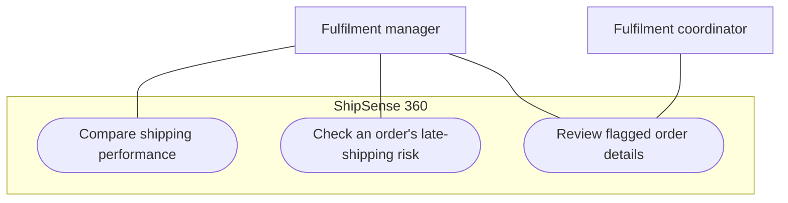

# ShipSense 360 Use Cases

```mermaid
flowchart TD
    M[Fulfilment manager]
    C[Fulfilment coordinator]

    subgraph ShipSense 360
        A([Compare shipping performance])
        B([Check an order's late-shipping risk])
        D([Review flagged order details])
    end

    M --- A
    M --- B
    M --- D
    C --- D
```